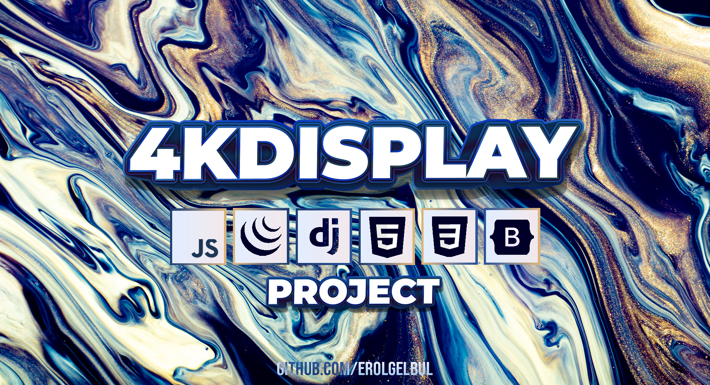

<div id="top"></div>

<div style="text-align:center"></div>

## 1. Introduction

### 1.1 Overview

Welcome to the 4K Display Django application project. This project utilizes
the power of JavaScript, AJAX, and Bootstrap 5.

The main goal of this project is to showcase 4K images on a small social media
platform.


### 1.2 Functionalities

1. CRUD app using Django, JavaScript, and AJAX.
2. Manipulating DOM with vanilla JavaScript.
3. Running AJAX calls and using AJAX & vanilla JavaScript in a Django project to improve user experience.
4. Implementing Bootstrap 5 elements such as modals, carousels.
5. Integrating Dropzone.js for a seamless file uploading experience.
6. Adding a spinner to the project to indicate ongoing processes.
7. Loading more data on a button click for a more dynamic user interface.
8. Implementing like/unlike functionality for posts using AJAX.
9. Creating custom decorators in Django for enhanced security and customization.

This project serves as a testament to the versatility and power of Django,
JavaScript, AJAX, and Bootstrap 5 when combined effectively. By exploring the
codebase and documentation, you will gain a deeper understanding of how these
technologies can be leveraged to create feature-rich, visually appealing, and
interactive web applications.

Feel free to dive into the project, study the implementation, and use it as a
reference or inspiration for your own Django-based projects. Contributions,
suggestions, and feedback are always welcome.

## 2. Getting Started

### 2.1 Tech Stack

<ins>Front-end frameworks</ins>: Bootstrap

<ins>Front-end libraries</ins>: jQuery, dropzone

<ins>Back-end frameworks</ins>: Django

<ins>RDBMS</ins>: SQLite

### 3. Installation

#### 3.1 Install Python

<ins>Windows</ins> 

1. Go to the official Python website:
[Python](https://www.python.org/downloads/windows/)
2. Download the latest version of Python for Windows by clicking on the
   "Download Python" button. Choose the version that is appropriate for your
   system (32-bit or 64-bit).
3. Open the downloaded installer and follow the installation wizard. Make sure
   to select the option "Add Python to PATH" during the installation process.

<ins>MacOS</ins> 

1. Go to the official Python website:
[Python](https://www.python.org/downloads/windows/)
2. Download the latest version of Python for Windows by clicking on the
   "Download Python" button. Choose the version that is appropriate for your
   system (32-bit or 64-bit).
3. Open the downloaded installer and follow the installation wizard. Make sure
   to select the option "Install for all users" and "Add Python to PATH" during
   the installation process.

<ins>Linux</ins> 

1. Open a terminal window.
2. Use the package manager for your Linux distribution to install Python. For
   example, on Ubuntu and Debian, you can use the command `sudo apt-get install
   python3` to install Python 3.
3. Verify that Python is installed by running the command `python3 --version` in
   the terminal. If Python is installed correctly, you should see the version
   number of Python that you installed.


#### 3.2 Install & Activate Virtual Environment

Depending on how you want to use this project, you may want to run it locally on
your machine. If so follow the steps on this section:

1. Install virtualenv: Once you have installed Python, you can install virtualenv using pip. Open your
terminal (Command Prompt for Windows) and type:
```bash
pip install virtualenv
```

<ins>MacOS & Linux</ins>

2. Create a virtual environment: To create a virtual environment, go to the
directory where you want to create it and run the following command:

```bash
virtualenv myenv
```
Here, myenv is the name of the virtual environment. You can choose any name you
want.

3. Activate the virtual environment: To activate the virtual environment,
run the following command:

```bash
source myenv/bin/activate
```

<ins>Windows</ins>

On Windows, the command is slightly different:

```bash
myenv\Scripts\activate.bat
```

#### 3.3 Install Requirements

1. Open the command prompt
2. Navigate to the directory that contains the requirements.txt file.
3. Run the following command:


```bash
pip install -r requirements.txt
```


## 3.4 Run on Local Server

Run inside the directory containing `manage.py` file:

```bash
python manage.py runserver
```

## 3.5 Run the migrations

Prepare:

```bash
python manage.py makemigrations
```

Run:

```bash
python manage.py migrate
```

## 4. Contributing

If you would like to add any extra features to the optimisation simulation, feel free to fork and create a pull request. Thank you!

1. Fork the Project
2. Create your Feature Branch (`git checkout -b feature/AmazingFeature`)
3. Commit your Changes (`git commit -m 'Add some AmazingFeature'`)
4. Push to the Branch (`git push origin feature/AmazingFeature`)
5. Open a Pull Request

<p align="right">(<a href="#top">back to top</a>)</p>


<!-- CONTACT -->
## 5. Contact

Erol Gelbul - [Website](http://www.erolgelbul.com)

Project Link: [4K Display](https://github.com/ErolGelbul/4k_display)

<p align="right">(<a href="#top">back to top</a>)</p>